# SuvBlog

Live website link: https://suv-blog.vercel.app

### About

This MERN Full stack web application is a Blogging Platform built with __React.js__ for frontend,
__Express.js__ for creating REST API, __MongoDB__ for database, __Tailwind CSS__ for the UI design and __React Context API__ for managing application states. It supports authentication with JSON Web Token for admins and users. Admins can create, post blogs, edit, delete their created blogs, and users can read the blogs. The backend is deployed on __Render__ and the frontend is deployed on __Vercel__.

### Home Page

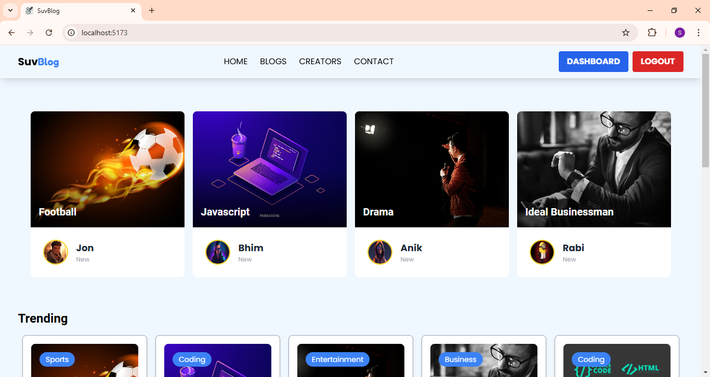

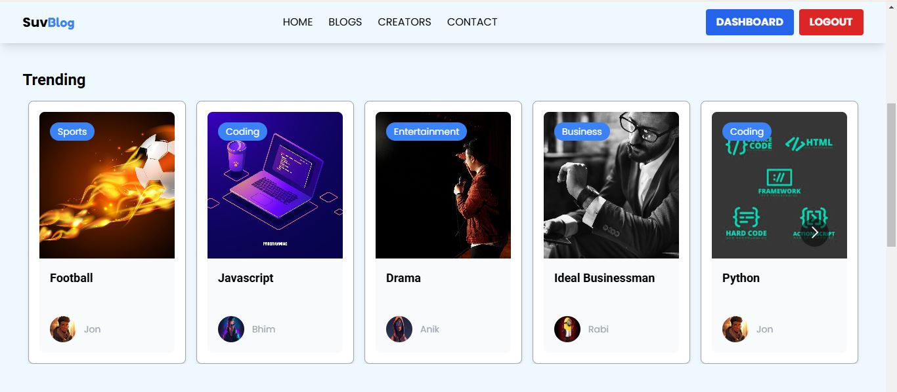

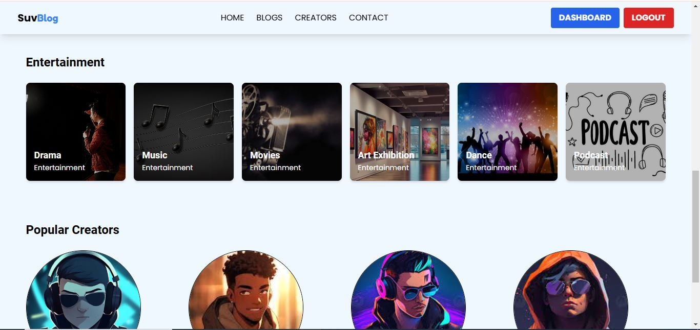

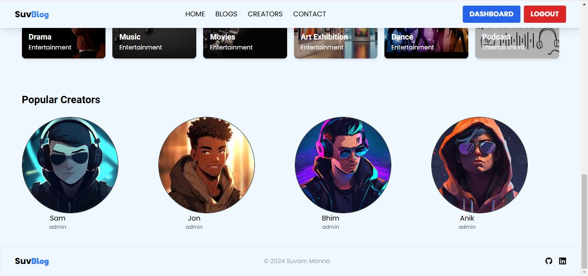

### Blogs Page

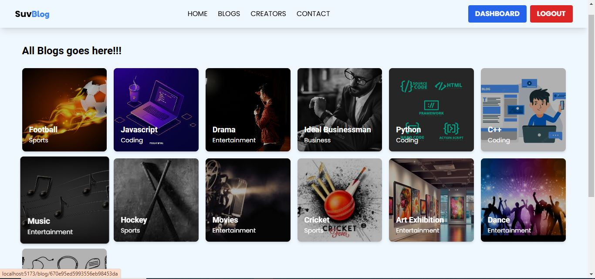

### Creators Page

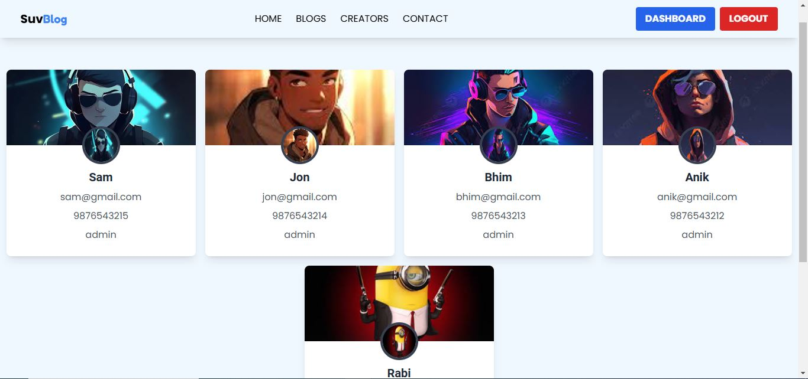

### Contact Page

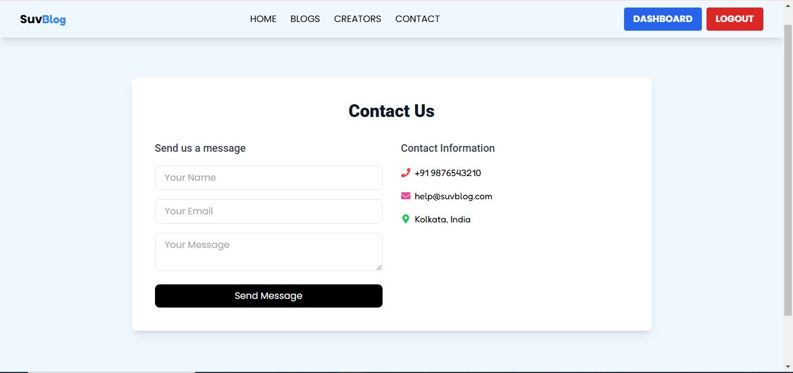

### Register Page

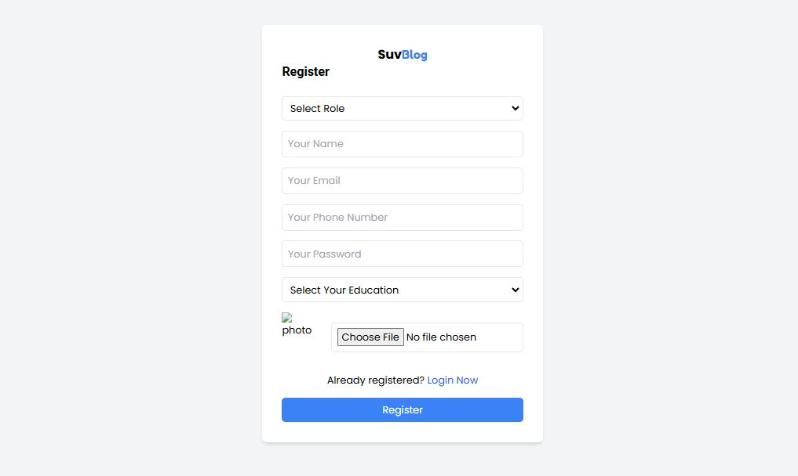

### Login Page

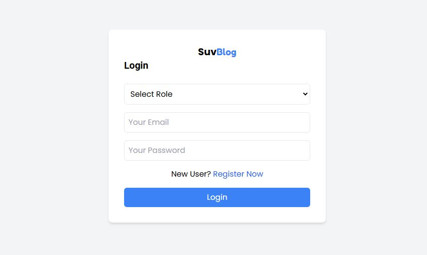

### Admin Dashboard Page

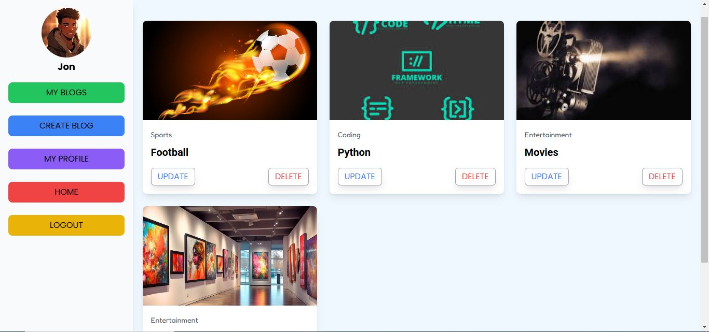

### Create Blog Page

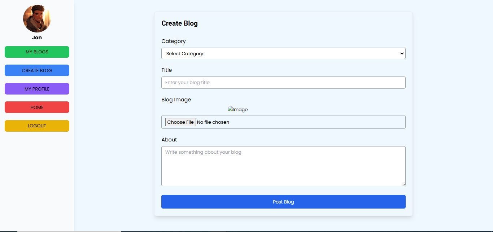

### Update Blog Page

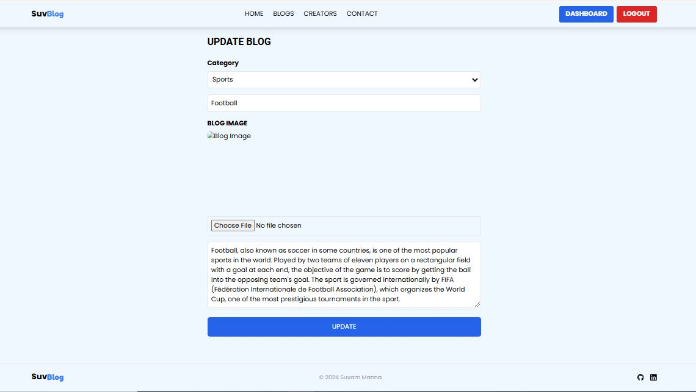

### Admin Profile Page

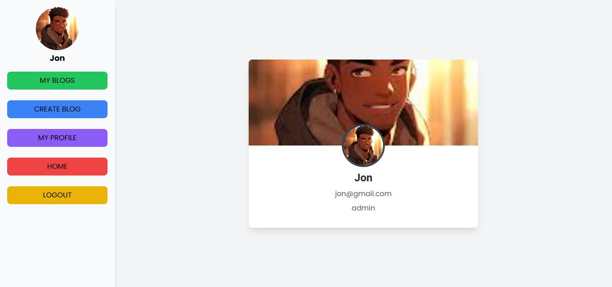

### Individual Blog Page

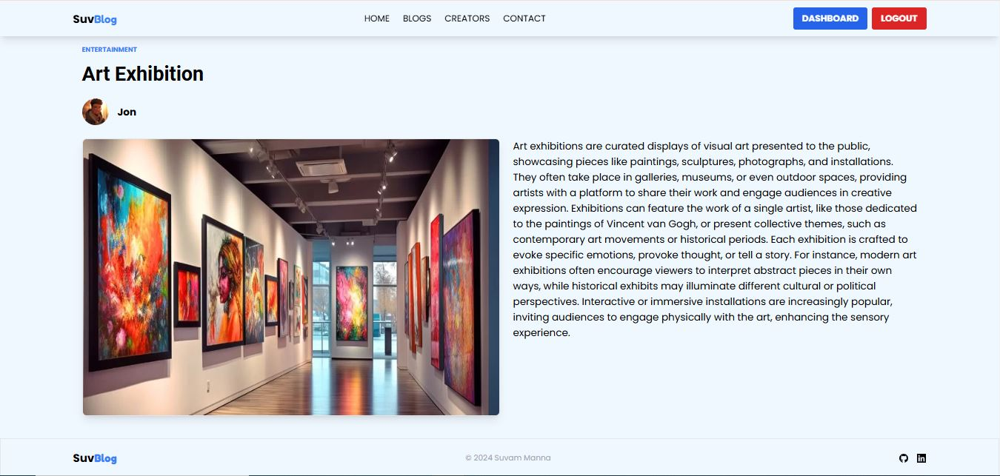
